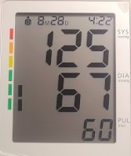

## TensoScan_IA_Model
This project implements a computer vision system using OpenCV and classic image processing to recognize digits from 7-segment displays in images. It is useful for automation, quality control, or reading numeric values from digital panels.

## Display Example

The system is designed to interpret images like this one:

## Key Features

- Image preprocessing using OpenCV
- Contour detection to isolate digits
- Segment-wise analysis to detect active/inactive segments
- Binary pattern matching for digit recognition
- Annotated visual output over the original image

## Technologies Used

- Python 3.x
- OpenCV
- NumPy
- Matplotlib
- Imutils

## Recognition Logic

1. **Load and resize the image**
2. **Apply adaptive thresholding** to binarize the image
3. **Detect the main contours** to find the display region
4. **Segment digits individually**
5. **Divide each digit into 7 predefined segments**
6. **Detect which segments are ON or OFF**
7. **Match binary pattern against digit templates**

## Project Structure
 seven_segment_digit_recognition
├── reconocimiento_numeros_siete_segmentos.ipynb # Main notebook
├── sample_display.jpg # Sample image
├── README.md # This file
├── requirements.txt # Python dependencies

## How to Run

### Open the file
Use Jupyter Notebook or Google Colab to run the file reconocimiento_numeros_siete_segmentos.ipynb

Example Output
The system will draw detected digits over the original image, along with visual markers and bounding boxes for each digit.

Possible Improvements
- Train a machine learning model for better generalization under noisy conditions.
- Add error handling for incomplete or damaged displays.
- Implement real-time digit detection via webcam.
