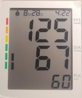
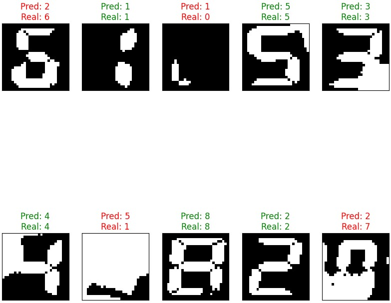

# 🔢 TensoScan_IA_Model

This project implements a computer vision system using OpenCV and classic image processing to recognize digits from 7-segment displays in images. It is useful for automation, quality control, or reading numeric values from digital panels.

## 🖼️ Display Example

The system is designed to interpret images like this one:

## ✨ Key Features

- 🧹 Image preprocessing using OpenCV  
- 🔍 Contour detection to isolate digits  
- 🧩 Segment-wise analysis to detect active/inactive segments  
- 🔢 Binary pattern matching for digit recognition  
- 🖍️ Annotated visual output over the original image  

## 🛠️ Technologies Used

- 🐍 Python 3.x  
- 🧊 OpenCV  
- 📊 NumPy  
- 📈 Matplotlib  
- 🧰 Imutils  

## 🧠 Recognition Logic

1. 📥 Load and resize the image  
2. 🌓 Apply adaptive thresholding to binarize the image  
3. 🔎 Detect main contours to find the display region  
4. 🔢 Segment digits individually  
5. 🔲 Divide each digit into 7 predefined segments  
6. ✅ Detect which segments are ON or OFF  
7. 🔢 Match binary pattern against digit templates  

## 📁 Project Structure

├── seven-segment number recognition.ipynb # Main notebook

├── img # Images directory

├── README.md # This file

## ▶️ How to Run

1. 📂 Open the file:  
   Use **Jupyter Notebook** or **Google Colab** to run `seven-segment number recognition.ipynb`.

2. ⚠️ **Important Note**:  
   You need to **edit the notebook** and change the file path to match your dataset location in your Google Drive (with your training and test images) before running it.

## ✅ Example Output

The system will draw detected digits over the original image, along with visual markers and bounding boxes for each digit.

## 🚀 Possible Improvements

- 🧠 Train a machine learning model for better generalization under noisy conditions  
- 🧯 Add error handling for incomplete or damaged displays  
- 📹 Implement real-time digit detection via webcam  

## 📄 License

This project is licensed under the **MIT License**.
